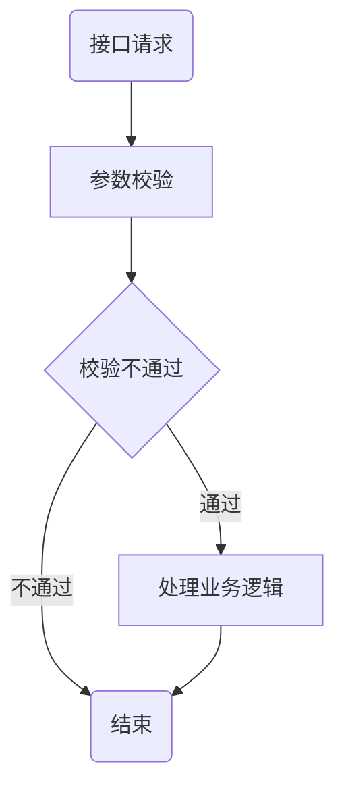
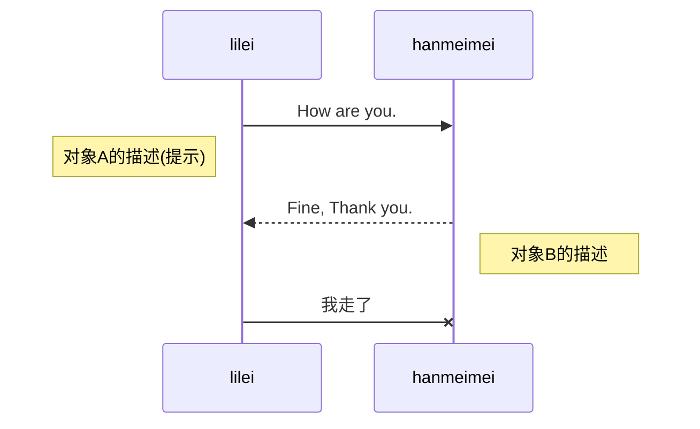

- [20.markdown](#20markdown)
  - [1 简介](#1-简介)
  - [2 功能](#2-功能)
    - [（1） 代码块](#1-代码块)
      - [python](#python)
      - [shell](#shell)
    - [（2） LaTeX 公式](#2-latex-公式)
    - [（3） 表格](#3-表格)
      - [形式一（|）](#形式一)
      - [形式二（table）](#形式二table)
    - [（4） 流程图](#4-流程图)
    - [（5） 插入图片](#5-插入图片)
    - [（6） 复选框](#6-复选框)


# 20.markdown

@(我的第一个笔记本)[帮助, Markdown]

**Markdown**通过精心的设计与技术实现，配合印象笔记强大的存储和同步功能，带来前所未有的书写体验。特点概述：
- **功能丰富** ：支持高亮代码块、*LaTeX* 公式、流程图，本地图片以及附件上传，甚至截图粘贴，工作学习好帮手；
- **得心应手** ：简洁高效的编辑器，提供[桌面客户端][1]以及[离线Chrome App][2]，支持移动端 Web；

-------------------


## 1 简介

> Markdown 是一种轻量级标记语言，它允许人们使用易读易写的纯文本格式编写文档，然后转换成格式丰富的HTML页面。    —— [维基百科](https://zh.wikipedia.org/wiki/Markdown)

正如您在阅读的这份文档，它使用简单的符号标识不同的标题，将某些文字标记为**粗体**或者*斜体*，创建一个[链接](http://www.example.com)或一个脚注[^demo]。下面列举了几个高级功能，更多语法请按`Ctrl + /`查看帮助。 


-------------------


## 2 功能

### （1） 代码块
#### python
```python
@requires_authorization
def somefunc(param1='', param2=0):
    '''A docstring'''
    if param1 > param2: # interesting
        print 'Greater'
    return (param2 - param1 + 1) or None
class SomeClass:
    pass
>>> message = '''interpreter
... prompt'''
```

#### shell
```shell
for i in $(seq 1 100)
do
    echo $i	
    echo "hello world"     #  打印
done
```


### （2） LaTeX 公式

可以创建行内公式，例如 $\Gamma(n) = (n-1)!\quad\forall n\in\mathbb N$。或者块级公式：

$$	x = \dfrac{-b \pm \sqrt{b^2 - 4ac}}{2a} $$

### （3） 表格

#### 形式一（|）
| Item      |    Value | Qty  |
| :-------- | --------:| :--: |
| Computer  | 1600 USD |  5   |
| Phone     |   12 USD |  12  |
| Pipe      |    1 USD | 234  |


| 姓名 | 特征 |
| ---- | ------------------------ |
| 小王 | 身高：175cm<br>体重: 45kg |


#### 形式二（table）
<table>
    <tbody>
        <tr>
            <td align="center">
                
            </td>
            <td align="center">
                
            </td align="center">
            <td align="center">
                
            </td>
        </tr>
        <tr>
            <td align="center">A chair that looks<br>like an avocado</td>
            <td align="center">An airplane that looks<br>like a banana</td>
            <td align="center">A spaceship</td>
        </tr>
        <tr>
            <td align="center">
                
            </td>
            <td align="center">
                
            </td>
            <td align="center">
                
            </td>
        </tr>
        <tr>
            <td align="center">A penguin</td>
            <td align="center">Ube ice cream cone</td>
            <td align="center">A bowl of vegetables</td>
        </tr>
    </tbody>
<table>


### （4） 流程图
```flow
st=>start: Start
e=>end
op=>operation: My Operation
cond=>condition: Yes or No?

st->op->cond
cond(yes)->e
cond(no)->op
```

以及时序图:

```sequence
Alice->Bob: Hello Bob, how are you?
Note right of Bob: Bob thinks
Bob-->Alice: I am good thanks!
```







### （5） 插入图片


### （6） 复选框

使用 `- [ ]` 和 `- [x]` 语法可以创建复选框，实现 todo-list 等功能。例如：

- [x] 已完成事项
- [ ] 待办事项1
- [ ] 待办事项2

> **注意：** 目前支持尚不完全，在印象笔记中勾选复选框是无效、不能同步的，所以必须在**马克飞象**中修改 Markdown 原文才可生效。下个版本将会全面支持。


  [1]: http://maxiang.info/client_zh
  [2]: https://chrome.google.com/webstore/detail/kidnkfckhbdkfgbicccmdggmpgogehop
  [3]: http://adrai.github.io/flowchart.js/
  [4]: http://bramp.github.io/js-sequence-diagrams/
  [5]: https://dev.yinxiang.com/doc/articles/enml.php


